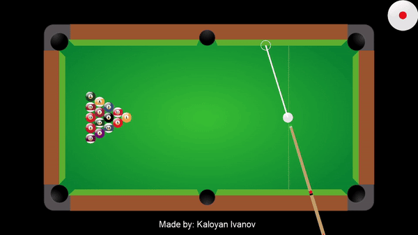

# 2D Pool simulation

A project I chose to work on for my Physics Programming assignment, which recreates a 2D Pool environment.

## Overview

Throughout the course, we studied various concepts concerning Vector Math, after wchich we got the chance to see them in practice by implementing our own Vec2 struct. Given that, all functionalities in the simulation, related to Vector Math, are implemented from the ground up, using the Vec2 struct.

## Features

- **Aiming functionality:** Manual and automatic
- **Cue charging:** Determines the power used to launch the cue ball
- **Ball-ball/Ball-line segment/Ball-line caps collision:** Correct detection and resolution of collisions
- **Ball-pocket detection:** Detects if a ball has gone in a given pocket
- **Cue ball spin modifier:** Determines cue ball spin and direction, depending on where the cue ball was hit
- **Shot-line indicator:** Helps players visualize the path the object ball will take after being struck by the cue ball

## Demo

   
  *<i>Low frame rate caused by gif limitations</i>*

## Controls

### Aiming
- **Manual:**
  1. Aim by **moving the mouse**
  2. When ready to shoot **press and hold the left mouse button** to adjust shooting power * *If you want to adjust the angle and you have already started charging, drag the mouse before the initial charge point and release the mouse button*
  3. **Release** to launch the cue ball
- **Automatic:**
  1. Aim by pressing **Q** or **E** to switch between object balls in the corresponding direction
  2. **Press or hold A or D** to adjust the angle more precisely
  3. When done adjusting the angle, by pressing **W** or **S**, you can adjust the shooting power
  4. Finally, press **ENTER** to launch the cue ball

### Spin and cue ball direction
1. By pressing or holding the arrow keys, you can adjust the spin and the direction of the cue ball
2. When ready, you can launch the cue ball and test what will happen :)
